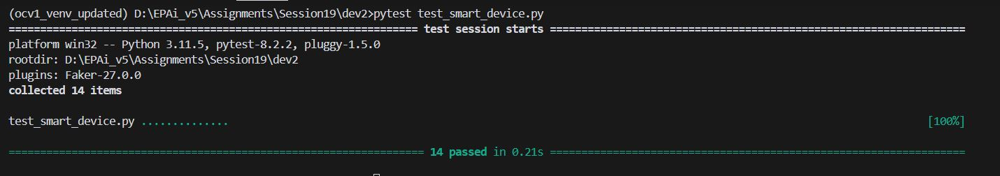
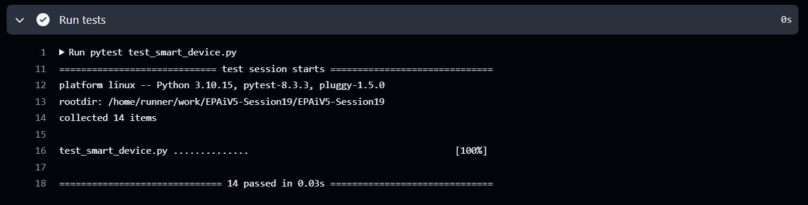

# EPAiV5-Session19 - Smart Device Management System


## Overview
The Smart Device Management System is a Python-based framework designed for managing IoT devices efficiently. It provides a flexible, extensible, and type-safe approach to track device statuses, manage online/offline states, and customize device information. This system is ideal for both smart home applications and industrial IoT environments.

## Features

- **Device Status Management:**

  - Update and monitor device-specific parameters dynamically.
  - Reset device status attributes to default values when needed.

- **Online/Offline State Tracking:**

  - Seamlessly toggle the online state of a device.

- **Customizable Device Information:**

  - Allows setting custom callable functions for personalized device descriptions.

- **Type-Safe Implementation:**

  - Includes robust type checking to ensure reliable input handling.

- **Device Counting Mechanism:**

  - Tracks the total number of devices created using a class-level counter.

- **Extensible Framework:**
  
  - Easily add new features without disrupting existing functionality.

## Installation

1. Clone the Repository:

```bash
git clone https://github.com/mHemaAP/EPAiV5-Session19.git
cd EPAiV5-Session19
```

2. Install Dependencies: If required, install dependencies using:

```
pip install -r requirements.txt
```

## Usage
1. Basic Example


```
from smart_device import SmartDevice

# Create a new smart device
device = SmartDevice("Camera", "C-3000")

# Update device status
device.update_status("battery", 80)

# Get device status
battery_level = device.get_status("battery")
print(f"Battery Level: {battery_level}")  # Output: Battery Level: 80

# Toggle device online status
device.toggle_online()
print(f"Device Online: {device.is_online}")  # Output: Device Online: True

# Get device information
print(device.device_info())  # Output: Device Name: Camera, Model: C-3000, Online: True

```

2. Custom Device Information


```
# Define custom device info function
def custom_info():
    return f"Security Device: {device.device_name}"

# Set custom device info
device.device_info = custom_info
print(device.device_info())  # Output: Security Device: Camera

```

## Key Class: SmartDevice
The `SmartDevice` class is the core component of the system. Below is a summary of its attributes and methods:

### Attributes
- `device_name`: Name of the device.
- `model_number`: Model identifier for the device.
- `is_online`: Online status of the device.
- `status`: A dictionary to store device-specific attributes.

### Methods
- `__init__(device_name: str, model_number: str, device_online: bool = False)`: Initializes the device with its name, model number, and online status.

- `update_status(attribute: str, value: Any) -> None`: Updates a status attribute for the device.

- `get_status(attribute: str) -> Any`: Retrieves the value of a specified attribute.

- `toggle_online() -> None`: Toggles the device's online status.

- `reset() -> None`: Resets all status attributes to their default values.

- `__call__() -> str`: Makes the device instance callable to return basic information.

- `device_info (Property)`: Get or set a callable function to provide custom device information.

## Testing
The system includes unit tests to validate its functionality. To run the tests, use:

```
pytest test_smart_device.py

```

## Test Resuts

#### Local PC Test Execution



#### Workflow Actions




## Future Enhancements
- Integration with IoT Protocols: Add support for MQTT, HTTP, or WebSocket communication.

- Persistent State Storage: Save and retrieve device statuses using databases or local files.

- Batch Device Management: Implement a system to manage multiple devices simultaneously.

## Conclusion
The Smart Device Management System simplifies the management of IoT devices, offering a robust foundation for both beginners and professionals. Its flexible design, type-safe implementation, and customizable features make it a valuable addition to any IoT project.
